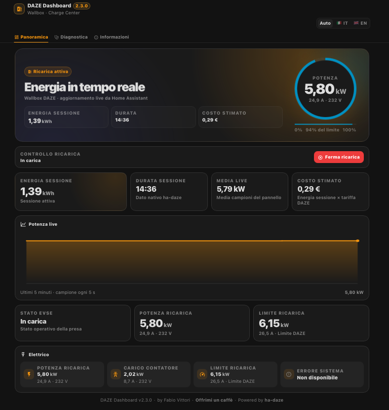
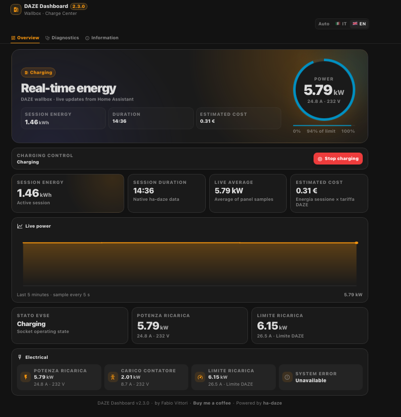
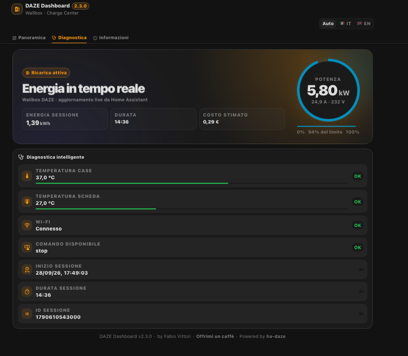
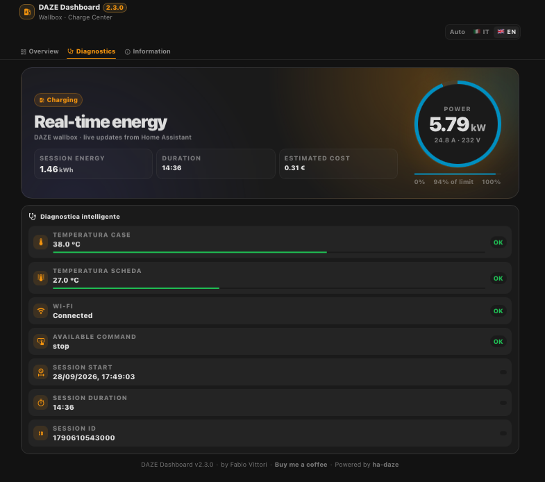
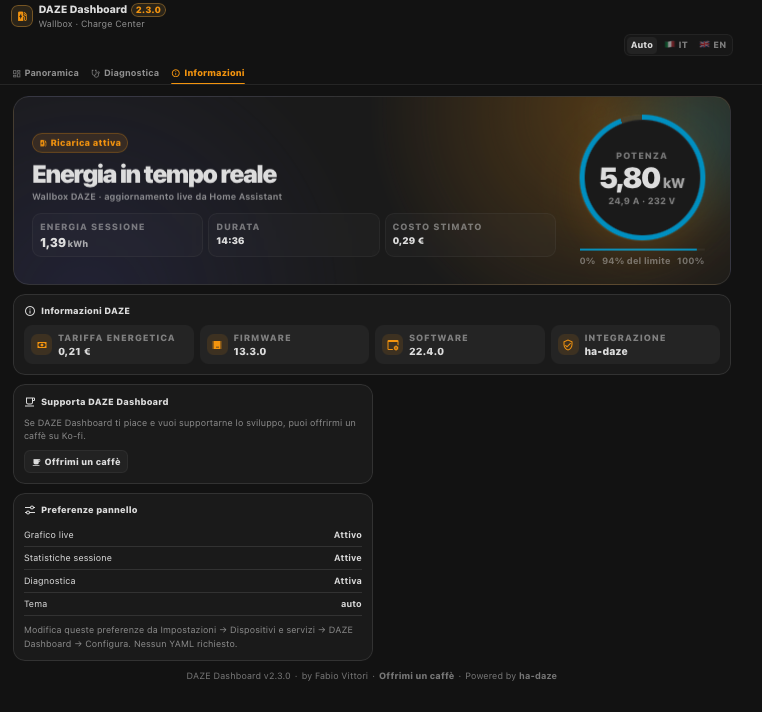
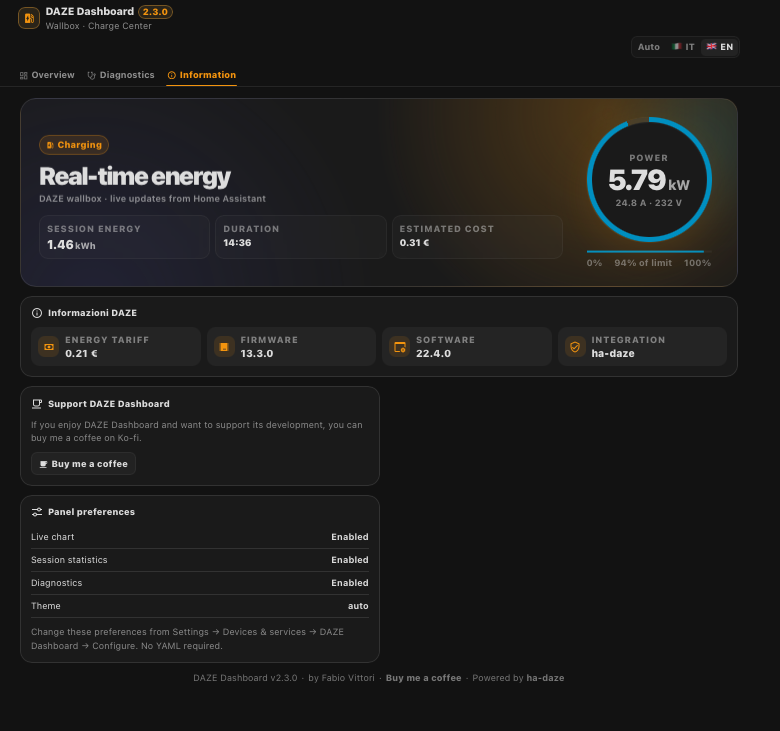

# ⚡ DAZE Dashboard

🇬🇧 [English](README.md) | 🇮🇹 Italiano

Una moderna dashboard laterale per Home Assistant dedicata alle wallbox DAZE.

> **Versione stabile:** v2.3.0

DAZE Dashboard è un progetto companion indipendente per [`ha-daze`](https://github.com/rdndnl/ha-daze).

## 🌐 Lingue
La dashboard supporta **Auto**, 🇮🇹 Italiano e 🇬🇧 English. In Auto segue la lingua di Home Assistant/browser.

## 🖼️ Screenshot

### Panoramica / Overview

| Italiano | English |
| --- | --- |
|  |  |

### Diagnostica / Diagnostics

| Italiano | English |
| --- | --- |
|  |  |

### Informazioni / Information

| Italiano | English |
| --- | --- |
|  |  |

## Installazione
Aggiungi `https://github.com/fabiovit/daze-dashboard` a HACS come **Integration**, installa DAZE Dashboard, riavvia Home Assistant e aggiungi l'integrazione da **Impostazioni → Dispositivi e servizi**.

È richiesto [`ha-daze`](https://github.com/rdndnl/ha-daze). Nessun YAML richiesto.

## Funzioni
- Pannello laterale dedicato
- Aggiornamenti live via WebSocket
- Potenza, energia sessione, corrente, tensione e limite di ricarica
- Comandi Avvia, Ferma e Riprendi ricarica tramite ha-daze
- Durata e inizio sessione nativi, ID sessione e utente quando disponibili
- Diagnostica adattiva che nasconde i dati non disponibili
- Grafico live e statistiche sessione
- Tema chiaro/scuro
- Layout desktop/mobile
- Lingua automatica Italiano/English con selettore manuale
- Supporto Ko-fi direttamente nella dashboard

## Privacy
Il progetto pubblico non contiene entity ID personali. Le entità vengono individuate automaticamente dal registro entità di Home Assistant usando le chiavi `unique_id` di `ha-daze`.

## ☕ Supporta DAZE Dashboard
Se DAZE Dashboard ti piace e vuoi supportarne lo sviluppo, puoi offrirmi un caffè su Ko-fi:

**https://ko-fi.com/fabvittori**

## Licenza
MIT
