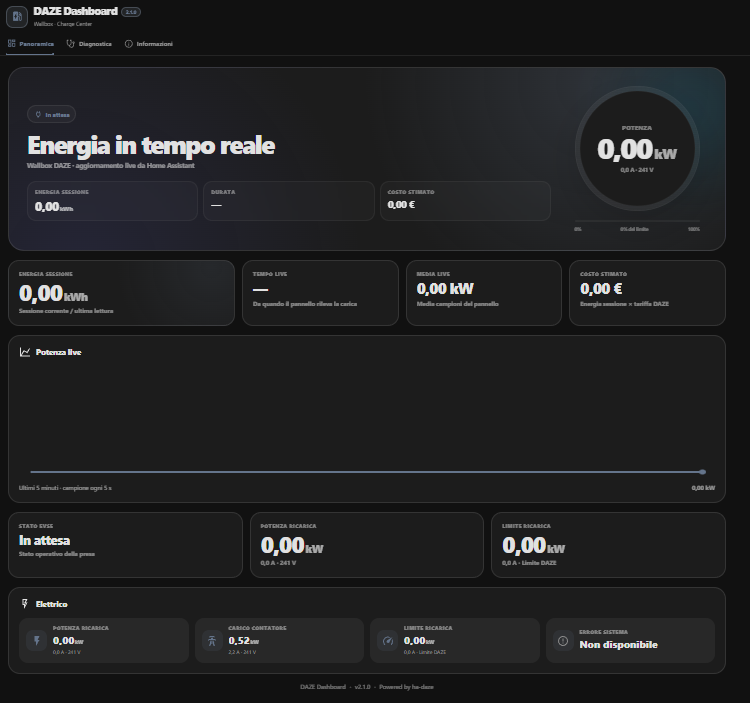
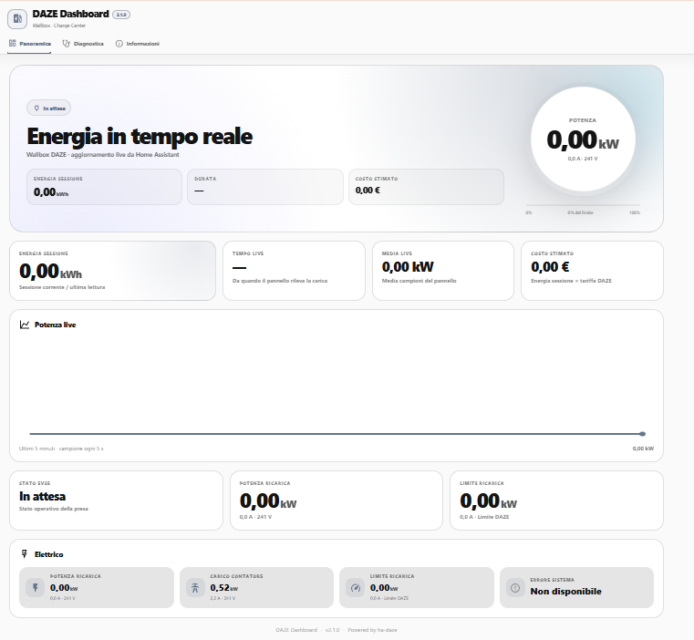
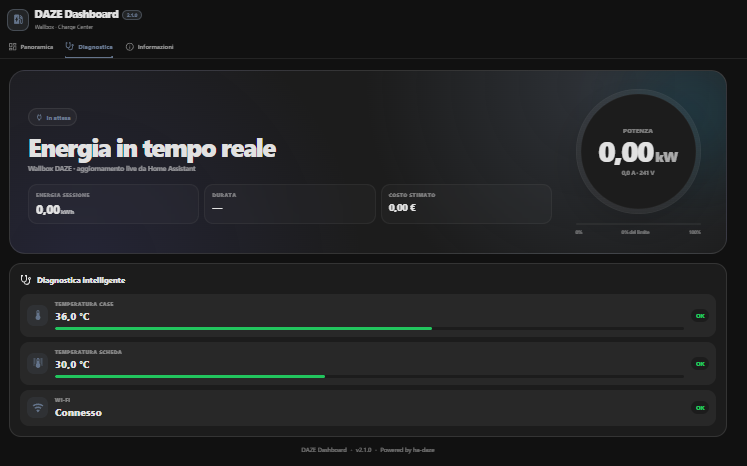
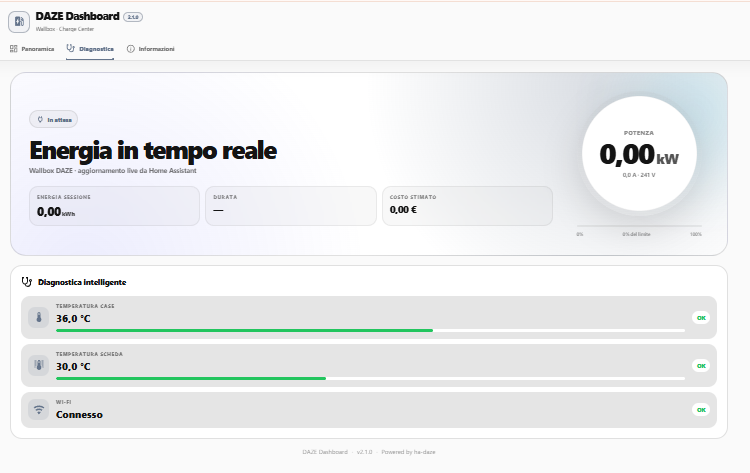
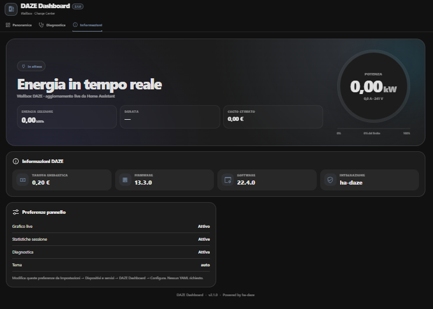
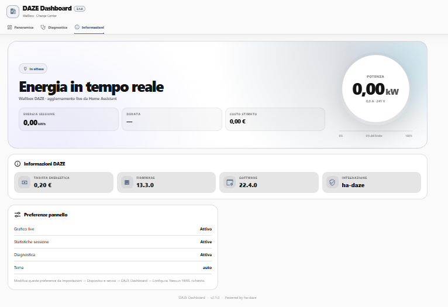

# ⚡ DAZE Dashboard

🇬🇧 English | 🇮🇹 [Italiano](README.it.md)

[](https://github.com/fabiovit/daze-dashboard/releases)
[](https://my.home-assistant.io/redirect/hacs_repository/?owner=fabiovit&repository=daze-dashboard&category=integration)
[](https://github.com/fabiovit/daze-dashboard/actions/workflows/validate.yml)
[](https://github.com/fabiovit/daze-dashboard/actions/workflows/hassfest.yml)
[](https://github.com/fabiovit/daze-dashboard/blob/main/LICENSE)

A modern Home Assistant sidebar dashboard for DAZE EV chargers.

> **Stable release:** v2.2.0

DAZE Dashboard is an **independent companion project** for
[`ha-daze`](https://github.com/rdndnl/ha-daze).

`ha-daze` remains responsible for communicating with DAZE and exposing the wallbox
entities in Home Assistant. DAZE Dashboard reads those existing entities and adds a
dedicated presentation layer. It does not replace, modify, or add polling to
`ha-daze` or the DAZE cloud.

## 🖼️ Screenshots

### Overview

| Dark | Light |
| --- | --- |
|  |  |

### Diagnostics

| Dark | Light |
| --- | --- |
|  |  |

### Information

| Dark | Light |
| --- | --- |
|  |  |

## Requirements

- Home Assistant 2026.3.0 or newer
- HACS (recommended)
- [`ha-daze`](https://github.com/rdndnl/ha-daze) installed and configured

## Installation with HACS

[](https://my.home-assistant.io/redirect/hacs_repository/?owner=fabiovit&repository=daze-dashboard&category=integration)

If needed, add this repository manually in **HACS → Custom repositories**:

```text
https://github.com/fabiovit/daze-dashboard
```

Repository type:

```text
Integration
```

Then:

1. Install **DAZE Dashboard**.
2. Restart Home Assistant.
3. Open **Settings → Devices & services → Add integration**.
4. Add **DAZE Dashboard**.
5. Open the new **DAZE** item in the Home Assistant sidebar.

No YAML configuration is required.

## Manual installation

Copy:

```text
custom_components/daze_dashboard
```

to:

```text
/config/custom_components/daze_dashboard
```

Restart Home Assistant and add **DAZE Dashboard** from **Devices & services**.

## Features

- Dedicated Home Assistant sidebar panel
- Config Flow and options flow
- Automatic privacy-safe `ha-daze` entity discovery
- Backend WebSocket subscription with live Home Assistant state updates
- Wallbox and EVSE state
- Charging power and session energy
- Charging/grid current and voltage
- Charging limit
- Case and board temperatures
- Fan and system diagnostics
- Five-minute live charging graph
- Live session timer and average power
- Estimated session cost when a tariff is available
- Responsive desktop/mobile interface
- Home Assistant light/dark theme support
- Mobile-only Home Assistant hamburger menu
- Overview, Diagnostics and Information views

## Architecture and privacy

Entity discovery happens in the Python backend using the Home Assistant entity
registry and the stable `unique_id` keys exposed by `ha-daze`.

```text
DAZE wallbox
     │
     ▼
   ha-daze
     │
     ▼
Home Assistant entities
     │
     ▼
DAZE Dashboard backend
     │ WebSocket
     ▼
DAZE Dashboard frontend
```

The public project contains no personal entity IDs, home names, wallbox serial
numbers, vehicle names, people, rooms, or custom helpers.

## UI options

Open:

**Settings → Devices & services → DAZE Dashboard → Configure**

Available options:

- Show/hide live power chart
- Show/hide session statistics
- Show/hide diagnostics
- Theme: Auto / Dark / Light

## Relationship with ha-daze

DAZE Dashboard is only the presentation layer.

Special thanks to
[`rdndnl/ha-daze`](https://github.com/rdndnl/ha-daze)
for the Home Assistant integration that exposes DAZE wallbox data.

DAZE Dashboard is **not affiliated with or endorsed by DAZE or the ha-daze project**.

## Issues

For DAZE Dashboard issues:

https://github.com/fabiovit/daze-dashboard/issues

For communication with the wallbox or entities supplied by the underlying
integration:

https://github.com/rdndnl/ha-daze/issues

## ☕ Support DAZE Dashboard

If you enjoy DAZE Dashboard and want to support its development, you can buy me a coffee on Ko-fi:

**https://ko-fi.com/fabvittori**

## License

MIT
